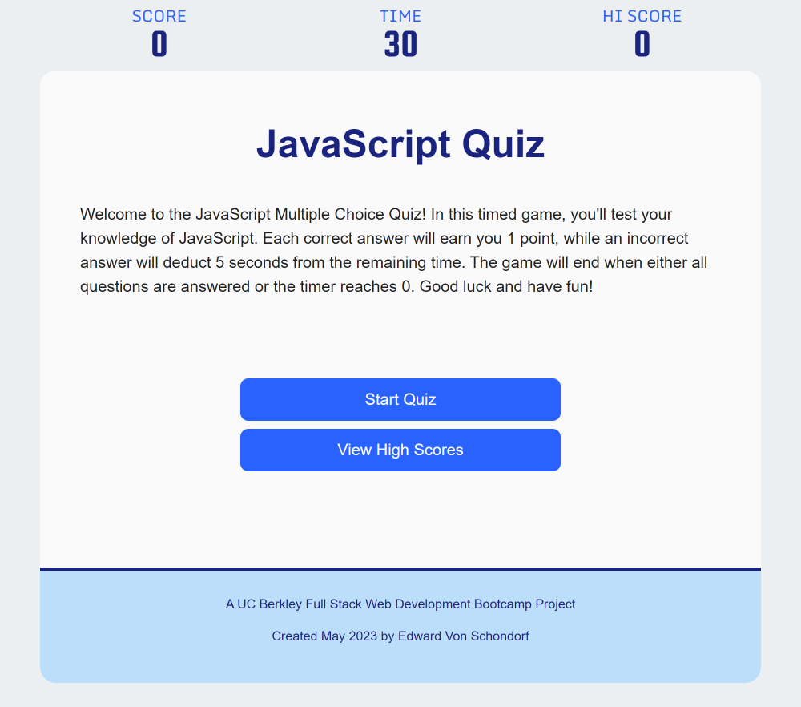

# Bootcamp-Week-04-Challenge

## Description

The week 04 challenge was to create a multiple choice JavaScript quiz that was timed, scored, and kept track of your scores, along with your initials you have to enter, by storing them in the local storage of the browser.  

## GitHub Pages

Visit the GitHub pages link to see website: [Coding Quiz](https://torvec.github.io/challenge_4_Coding_Quiz/)

## Visuals

## Installation

N/A

## Usage

This page is used for grading purposes by the UC Berkley coding bootcamp staff.

## Credits

- Google Fonts: [Monda](https://fonts.google.com/specimen/Monda?preview.text=SCORE&preview.size=60&preview.text_type=custom&category=Sans+Serif,Display,Monospace)
- Google Fonts: [Squada One](https://fonts.google.com/specimen/Squada+One?preview.text=69&preview.size=60&preview.text_type=custom&category=Sans+Serif,Display,Monospace)
- Bootstrap Colors: [MDBootstrap](https://mdbootstrap.com/docs/b4/jquery/css/colors/)
- Edward Von Schondorf

## License

N/A

## Badges

N/A

## Features

- Multiple choice, timed, and scored coding quiz

## How to Contribute

N/A

## Project Status

Completed 31 May 2023